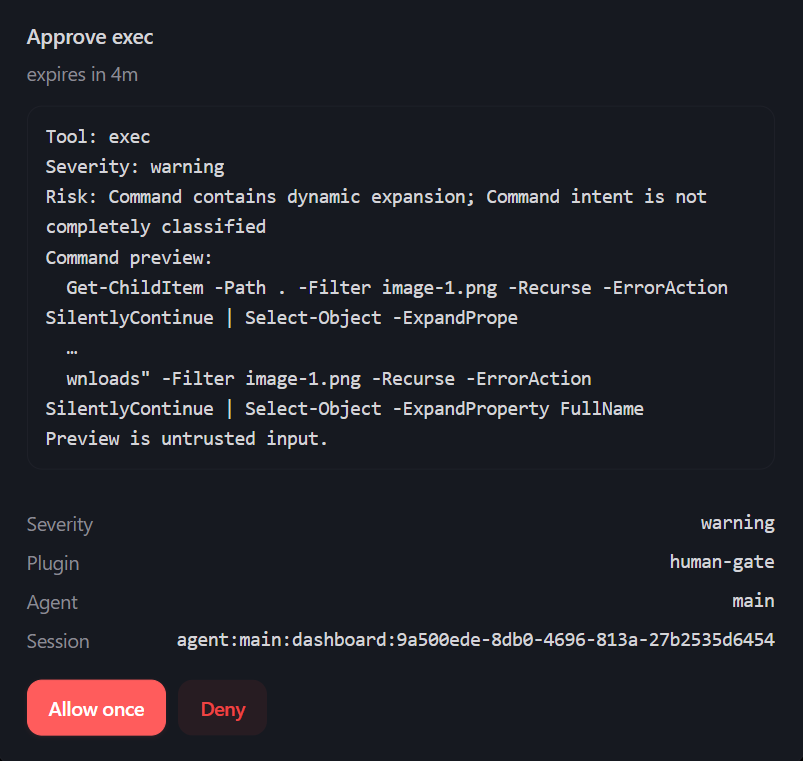

# openclaw-human-gate

[](https://www.npmjs.com/package/openclaw-human-gate)

[](https://www.npmjs.com/package/openclaw-human-gate)

Human-in-the-loop approval middleware for [OpenClaw](https://github.com/openclaw/openclaw).

Intercepts tool execution with a `before_tool_call` hook and routes selected
calls through OpenClaw's **built-in** approval flow. When a call needs human
confirmation, the agent run is paused and the approval request is pushed to
every connected approval surface — the official TUI, the Control UI (Web), and
any chat channel that supports `/approve`. This plugin does **not** implement
its own terminal UI; it reuses OpenClaw's.

```
                 Agent
                   |
              Tool call
                   ↓
          Human Gate Plugin
          /             \
     auto               require-approval
                               ↓
                       OpenClaw approval flow
                       (TUI / Web UI / /approve)
                               ↓
                       allow-once / allow-always / deny
```

## Features

- **`before_tool_call` interception** — every tool call is classified before
  execution via a priority-60 gate, then a final ordinary-hook parameter seal
  restores the exact payload that gate inspected.
- **Built-in approval workflow** — selected calls pause the run and ask the
  human through OpenClaw's own approval surfaces (TUI / Control UI / chat
  `/approve`); no custom UI to learn.
- **Three policy modes per rule** — `auto` (pass), `require-approval` (prompt),
  `block` (deny with reason), with a configurable `defaultMode` fallback.
- **Zero-config fail-closed defaults** — reads pass, destructive calls
  (`exec`, `apply_patch`, `code_mode_exec`) prompt, and anything unrecognised
  prompts too (`defaultMode: "require-approval"`).
- **Semantic approval window** — approving one analyzed call may auto-pass only
  calls with the configured semantic fingerprint for the rest of the turn (or
  a time box). The fail-closed default is directory-scoped.
- **Upgrade-only semantic analysis** — shell, Code Mode, and file-mutation
  parameters are inspected before approval. Remote pipe-to-shell, recursive forced deletion,
  force pushes, destructive infrastructure operations, production deployment,
  encoded execution, and likely credential exfiltration are promoted to
  `critical`. Common dev-loop intents (`build`, `test`, `format`, `git commit`)
  are recognized as reusable semantic categories. Semantic analysis never
  downgrades a policy decision.
- **Content-aware approval previews** — command/code, write, edit, and
  `apply_patch` inputs receive bounded previews. Secrets, ANSI controls, and
  bidirectional Unicode controls are sanitized before display.
- **Bounded `allow-always` lease** — remembered decisions are session-local,
  path-bound, and expire after `allowAlwaysTtlMs` (default 4h). The native
  button still reads "allow-always"; internally it is a bounded session/task
  lease, never an unlimited grant.
- **Experimental adaptive safe-file lease** — an opt-in controller can shadow,
  suggest, or enforce a finite-use, short-lived lease for completely analyzed,
  non-destructive file writes with absolute targets. It never learns authority
  from `allow-once`, and it never applies to shell/Code Mode/network actions.
- **Auto-pass for cron / heartbeat** — scheduled runs are never blocked on an
  approval nobody can see; critical semantic risks fail immediately by default.
- **`human_gate_ask` tool** — Claude Code-style "ask the human" for
  clarification or decisions.

## How it works

OpenClaw already ships a first-class approval mechanism: a `before_tool_call`
hook may return `{ requireApproval: { ... } }`, and the Gateway handles pausing
the run, rendering the prompt in the TUI / Control UI, enforcing the timeout,
and applying the decision. `deny`, `timeout`, and `cancelled` fail closed
(blocked).

This plugin is the **policy layer** on top of that mechanism: it decides which
calls need approval, with what severity and timeout, and can remember a
path-bound `allow-always` decision per session when complete analysis supports
a narrow grant fingerprint.

## Default posture (fail-closed)

The plugin does **not** intercept every tool by default — that would be
unusable. Instead it classifies each call and prompts for anything that might
have side effects; reads pass through:

1. **User rules** (first match wins) — explicit override, optionally scoped to
   direct tool parameters with a strict one-level matcher.
2. **Built-in destructive toolKinds** — `exec`, `apply_patch`, `code_mode_exec`
   → `require-approval`.
3. **Name-token classifier** (host `toolKind` first, then the whole tool name
   split into tokens across camelCase / snake_case / kebab-case):
   - **destructive token anywhere in the name** (`write`, `delete`, `edit`,
     `remove`, `run`, `send`, `create`, `update`, …) → **require-approval** —
     checked **before** read-only tokens, so a composite name like
     `readWriteFile` or `getDeleteUser` is gated, never auto-passed
   - read-only tokens only (`read`, `get`, `list`, `search`, `fetch`, `cat`,
     …) → **auto** (pass through)
   - neither → **unknown** → falls to `defaultMode`
4. **`defaultMode`** — fallback for unrecognised tools. Defaults to
   **`require-approval`** (fail-closed: an unknown tool must be approved). Set
   to `auto` only if you accept unknown tools passing through ungated.

Disable classification with `useClassifiers: false` to rely solely on explicit
rules + `defaultMode`.

## Auto-pass system contexts (cron / heartbeat)

Scheduled runs (cron jobs, heartbeat) have no human at the keyboard, so an
approval prompt would stall them indefinitely. By default the gate
**auto-passes non-critical approval prompts** in sessions whose key contains a matching
`:`-delimited segment — `:cron:` or `:heartbeat` (cron isolated runs and
heartbeat isolated runs — enable
`agents.defaults.heartbeat.isolatedSession: true` so heartbeat runs get their
own `<session>:heartbeat` key):

```json5
{
  autoPassSessionKeys: [":cron:", ":heartbeat"], // exact session-key segments that skip the prompt
}
```

- Auto-pass exempts **only the approval prompt** (`require-approval` calls
  proceed without waiting). **`block` rules are still enforced** — a tool the
  operator explicitly banned never runs, even in an unattended context.
- Semantically `critical` calls are blocked by default rather than silently
  executed. Set `unattendedPolicy.critical: "auto"` only to restore the legacy
  behavior for critical calls.
- Matching is **exact per `:`-delimited segment**, not substring: `:cron:`
  matches `agent:main:cron:run-1` but not `agent:x:cronx:`. Keys may be
  written with or without colons (`":cron:"`, `":heartbeat"`, `"subagent"`
  all work); a bare value matches only a standalone segment.
- Add your own segments (e.g. `:subagent:`) to auto-pass other run kinds;
  remove the defaults to gate everything again.
- Regular interactive sessions never match these, so approvals still apply
  when a human is present.

## Approval window (less popup fatigue)

Gating every write means a multi-step task (refactor 10 files) prompts 10
times. The approval window reduces that fatigue without treating every call to
the same tool as equivalent. After approval, a call may auto-pass only when its
versioned semantic fingerprint matches an open window.

```json5
approvalWindow: {
  mode: "turn",          // "off" | "turn" | "time"  (default "turn")
  scope: "path",         // default: exact analyzer-verified directory set
  pathFallback: "none",  // "none" | "category" | "effect"
  ttlMs: 300000,         // for "time" mode only
  bypassCritical: true   // severity "critical" always prompts (e.g. prod deploys)
}
```

- `mode: "turn"` — once approved, matching fingerprints auto-pass for the rest of
  the current agent run; a new user turn resets. (default)
- `mode: "time"` — once approved, matching fingerprints auto-pass for `ttlMs`.
- `mode: "off"` — prompt every gated call (per-call behavior).
- `scope: "path"` — the safe default. The key includes tool/policy identity,
  complete effect and category sets, and the sorted exact set of every
  analyzer-verified target directory; it never collapses multiple directories
  to a shared ancestor. File targets are parent-directory scoped, so
  `C:\repo\src\foo.ts` can share with `C:\repo\src\bar.ts` but not with a
  system, SSH, `.git`, or unrelated workspace directory. Normalization is
  lexical and performs no filesystem reads. Relative targets require a
  host-authoritative execution cwd; OpenClaw 2026.7.1 does not currently expose
  that field to plugin hooks, so relative writes deliberately prompt again and
  do not offer `allow-always`. Use absolute tool targets for reusable path
  authorization until the host exposes resolved execution targets.
- `scope: "category"` — includes tool/policy identity plus the complete effect
  and finding-category sets.
- `scope: "effect"` — includes tool/policy identity plus the complete effect
  set.
- `scope: "same-tool"` — compatibility scope keyed by the complete tool and
  matched-policy identity, not just the visible tool name.
- `scope: "destructive"` — legacy global compatibility window. This is the
  broadest option; keep it only when deliberately preserving old behavior.
- `pathFallback: "none"` — when a verified path scope cannot be built, do not
  open a reusable window. `category` and `effect` are explicit broader opt-ins;
  fallback windows are distinguishable from directly configured scopes.
- `bypassCritical: true` — `severity: "critical"` calls (e.g. a `deploy-prod`
  rule) always prompt even when a window is open.

### Development-loop intents (build / test / format / git commit)

The command analyzer recognizes a conservative set of dev-loop commands as
complete, window-eligible intents with distinct categories (`dev-build`,
`dev-test`, `dev-format`, and `source-control` for `git commit`):

- Build — `npm run build`, `yarn build`, `make`, `tsc`, `cargo build`, `go build`, …
- Test — `npm test`, `pytest`, `cargo test`, `go test`, `jest`, `vitest`, …
- Format — `prettier --write`, `eslint --fix`, `gofmt -w`, `rustfmt`, `black`, …
- Git commit — `git commit` (local history write; `git push` stays a network write).

Only a single, non-dynamic invocation with no pipes/redirections is reusable;
compound commands (`npm test && npm run build`) and check-only formatters
(`prettier --check`, `eslint` without `--fix`) stay fail-closed. These intents
have no file targets, so under the default `scope: "path"` they cannot open a
window. To reuse them per turn (or per time box) while keeping relative-path
writes per-approval, set `pathFallback: "category"`:

```json5
approvalWindow: {
  mode: "turn",
  scope: "path",
  pathFallback: "category", // dev intents fall back to category; relative writes still fail closed
  bypassCritical: true,
}
```

The window is opened only when you approve a call (`allow-once` or
`allow-always`) **and** complete analysis produces a reusable fingerprint.
Empty semantics, an `unknown` effect/category, partial or failed analysis, an
unverified path with `pathFallback: "none"`, missing trusted session identity,
or missing run identity in `turn` mode never open a window. `deny`, `timeout`,
and `cancelled` do not open one.

`allow-always` is stricter than a temporary window: the choice is offered and
remembered only when Human Gate can construct a narrow path-bound grant
fingerprint containing the full policy identity and semantic sets. A broad
`destructive`, `effect`, or `category` window therefore cannot become a broad
permanent grant. Semantic `critical` calls bypass reusable authorization and do
not offer `allow-always`. Every grant is a **bounded lease** that expires
`allowAlwaysTtlMs` after it is granted (default 4h); old grants without an
expiry are discarded on upgrade.

### Experimental adaptive safe-file leases

Adaptive auto-pass is a separate, default-off controller. Its first production
scope is deliberately narrow: `write`, `edit`, and non-delete/non-move
`apply_patch` calls whose semantic report is complete, whose only effect and
category are `local-write` / `filesystem`, and whose analyzer-verified targets
are absolute paths with a path-bound grant fingerprint.

```json5
adaptiveAutoPass: {
  mode: "off",              // "off" | "shadow" | "suggest" | "enforce"
  ttlMs: 900000,            // fixed lease lifetime; 1 minute..1 hour
  maxUses: 20,              // deducted before execution; never outcome-refunded
  suggestAfterApprovals: 2  // allow-once evidence needed for a suggestion
}
```

- `off` preserves the existing grant/window behavior.
- `shadow` emits bounded candidate metadata but changes no decision, approval
  text, or state.
- `suggest` keeps legacy authorization behavior and may add a preview-only
  lease hint after repeated matching `allow-once` approvals. Those approvals
  are evidence only and never create an authorization.
- `enforce` owns reuse for eligible safe-file calls. Existing legacy grants and
  windows are ignored for those calls. `allow-once` authorizes only the current
  call; an explicit `allow-always` decision creates a path-bound lease with the
  configured fixed expiry and use budget.

Every adaptive use is atomically deducted from session state before execution.
An expired, exhausted, malformed, version/config-mismatched, or persistence-
failed lease prompts again. Tool success is not treated as evidence and a
failed tool call does not refund a consumed authorization. A `deny` resolution
revokes matching adaptive evidence and lease state.

The controller never accepts relative paths, delete/move patches, explicit
user-policy matches, param-scoped rules, critical/destructive/unknown/partial
analysis, commands, build/test/format, Git operations, network writes, or Code
Mode. Build/test/format/commit remain eligible only for the existing
human-approved turn window; adaptive enforcement needs authoritative execution
cwd/repository identity and a host sandbox first.

Switching from `enforce` back to `off`, `shadow`, or `suggest` restores legacy
behavior and can expose a still-valid legacy grant/window that predates
enforcement. For an emergency prompt-every-call rollback, also set
`rememberAllowAlways: false` and `approvalWindow.mode: "off"` until that state
has drained.

### Migration from `match`

Existing explicit values remain accepted: `match: "same-tool"` maps to
`scope: "same-tool"`, and `match: "destructive"` maps to
`scope: "destructive"`. If both fields are present, `scope` wins. New or
unconfigured installations resolve to `scope: "path"` and
`pathFallback: "none"`; `match` is deprecated and has no schema default.

The fingerprint and persisted-state format is versioned. On upgrade, legacy
v1 approval windows and remembered grants are intentionally discarded, so the
next matching call asks for approval again instead of reviving a broader key.

## Parameter-aware semantic analysis

The built-in analyzer registry runs after the base tool policy and before any
auto, unattended, remembered-grant, or approval-window decision. The initial
release is deliberately **upgrade-only**: analysis may require approval or
raise severity, but it never turns an approved/gated call into an automatic
pass.

The shell analyzer uses a quote-aware scanner for POSIX shell, PowerShell, and
CMD operators. It does not execute commands, expand variables, resolve aliases,
or read files. Code Mode has a separate analyzer because its `command` field is
JavaScript/TypeScript source, not a shell command.

```json5
semanticAnalysis: {
  enabled: true,
  maxCommandLength: 16384,
  maxWrapperDepth: 3,
  maxFindings: 8
},
unattendedPolicy: {
  critical: "block" // "block" | "auto"
}
```

Analyzer findings use stable IDs and are combined monotonically. A failed
analyzer requires approval and disables window reuse instead of failing open.

## Approval previews

Approval descriptions are limited by OpenClaw to 512 characters, so Human Gate
shows a prioritized excerpt rather than pretending to provide a complete diff:

- `exec` and Code Mode: command or code excerpt;
- write tools: content size, line count, and leading excerpt;
- edit tools: first old → new replacement and replacement count;
- `apply_patch`: file and line counts plus a bounded patch excerpt.

All preview content is treated as untrusted input. Secret-like assignments,
Bearer tokens, JWTs, private keys, ANSI escapes, control characters, and bidi
controls are removed or marked before the final hard length limit is applied.
Human Gate snapshots the parameters before analysis and returns that isolated
snapshot with the approval result, binding the approved preview to the input
handed back to the host. A lowest-priority parameter-sealer hook also restores
that gate-time snapshot after ordinary plugin rewrites, including in-place
mutation. OpenClaw does not expose a reserved finalizer slot: installed plugins
run as trusted in-process code, so a hostile plugin can still bypass any plugin
policy and should not be installed.

## Install

```bash
# from ClawHub / npm (once published)
openclaw plugins install openclaw-human-gate

# from a local tarball (for development)
npm pack --pack-destination /tmp
# uninstall first if an older version is installed, then install the new pack
openclaw plugins uninstall human-gate
openclaw plugins install npm-pack:/tmp/openclaw-human-gate-0.3.0.tgz

# inspect
openclaw plugins inspect human-gate --runtime --json
```

Requires OpenClaw `>= 2026.7.1` (Node 22.22.3+ / 24.15+ / 25.9+).

## Screenshots

> Screenshots go here — approval prompt in the Control UI / TUI, and an example
> `human_gate_ask` question in chat. (TODO: add captures)


## Build

```bash
npm install
npm run build      # emits ./dist
npm run typecheck  # tsc --noEmit
npm test           # build + classifier matrix + session-state tests
```

## Configure

The plugin reads its config from OpenClaw's plugin config
(`plugins.entries.human-gate.config`). Evaluation order: user rules → built-in
destructive toolKinds → name-token classifier → `defaultMode`. See
**Default posture** above.

```json5
{
  plugins: {
    entries: {
      "human-gate": {
        enabled: true,
        config: {
          defaultMode: "require-approval", // fail-closed: unknown tools prompt
          defaultSeverity: "warning",
          defaultTimeoutMs: 300000,
          rememberAllowAlways: true,
          useClassifiers: true,
          semanticAnalysis: {
            enabled: true,
            maxCommandLength: 16384,
            maxWrapperDepth: 3,
            maxFindings: 8
          },
          previews: {
            enabled: true,
            maxDescriptionChars: 512,
            maxSectionChars: 220,
            maxLines: 12,
            maxFiles: 4,
            redactSecrets: true
          },
          unattendedPolicy: {
            critical: "block"
          },
          approvalWindow: {
            mode: "turn",
            scope: "path",
            pathFallback: "none",
            ttlMs: 300000,
            bypassCritical: true
          },
          rules: [
            {
              id: "process-observation-auto",
              toolName: "process",
              paramMatcher: {
                all: [{ key: "action", in: ["list", "poll", "log"] }]
              },
              mode: "auto",
              reason: "Read-only process observation"
            },
            {
              id: "session-observation-auto",
              toolNamePattern: "^(?:sessions_list|sessions_history|subagents)$",
              paramMatcher: {
                any: [
                  { key: "action", missing: true },
                  { key: "action", equals: "list" }
                ]
              },
              mode: "auto",
              reason: "Read-only session observation"
            }
          ]
        }
      }
    }
  }
}
```

### Rule fields

| field             | type                                                       | meaning                                                                 |
| ----------------- | --------------------------------------------------------- | ----------------------------------------------------------------------- |
| `id`              | string (required)                                         | Stable id; used in logs and allow-always keys.                          |
| `toolName`        | string                                                    | Exact tool name match. Omit to match any.                               |
| `toolNamePattern` | string (regex source)                                     | Matched against `toolName`; an invalid regex makes the rule non-matching and is never treated as match-all. |
| `toolKind`        | string                                                    | Match host `toolKind` (e.g. `exec`, `code_mode_exec`, `apply_patch`).   |
| `paramMatcher`    | `{all: condition[]}` or `{any: condition[]}`              | Match direct, own parameters with one bounded boolean group.           |
| `mode`            | `auto` \| `require-approval` \| `block` (required)        | Decision for a matched call.                                            |
| `severity`        | `info` \| `warning` \| `critical`                         | Shown in the approval UI. Defaults to `defaultSeverity`.               |
| `allowedDecisions`| `["allow-once","allow-always","deny"]`                    | Decisions offered to the approver.                                      |
| `timeoutMs`       | integer (1000–600000)                                     | Approval timeout. Defaults to `defaultTimeoutMs`.                       |
| `reason`          | string                                                    | Human-readable reason in the approval request / block reason.           |

Parameter conditions have exactly one operator:

- `{ key: "action", equals: "list" }` uses strict JSON-scalar equality.
- `{ key: "action", in: ["list", "poll", "log"] }` matches one member.
- `{ key: "action", missing: true }` matches only when the call has no direct,
  own property with that name.

`all` is logical AND and `any` is logical OR. Matchers are deliberately only
one level deep. Nested groups, empty arrays, extra fields, non-scalar values,
dotted/bracketed paths, and `__proto__` / `prototype` / `constructor` keys are
invalid. Invalid matchers, accessor properties, inherited values, or a missing
parameter required by `equals` / `in` make the rule non-matching. Evaluation
continues to later rules and the fail-closed built-in/default policy.

The process example therefore auto-passes only `list`, `poll`, and `log`;
`write`, `kill`, an unknown action, or a missing action does not match. The
session rule uses an exact tool-name pattern instead of a broad `sessions_*`
prefix. Separately, `session_status` with a direct `model` parameter is treated
as a state change and requires approval.

### Built-in behavior (applied when no user rule matches)

Destructive toolKinds (always gated): `exec`, `apply_patch`, `code_mode_exec`.

Name-token classifier (`useClassifiers: true`, default) — the whole tool name
is split into tokens (camelCase / snake_case / kebab-case / digits), then:
- **destructive token anywhere** → `require-approval` (checked FIRST so
  composite names like `readWriteFile`, `getDeleteUser`, `listAndRemove` are
  gated, never auto-passed): `write`, `edit`, `delete`, `remove`, `rm`, `rmdir`,
  `mkdir`, `move`, `rename`, `deploy`, `publish`, `install`, `uninstall`,
  `exec`, `run`, `apply`, `patch`, `create`, `update`, `kill`, `send`, `post`,
  `put`, `push`, `commit`, `flush`, `drop`, `truncate`, `grant`, `revoke`
- read-only tokens only → `auto`: `read`, `get`, `list`, `search`, `glob`,
  `grep`, `view`, `show`, `status`, `ping`, `fetch`, `head`, `cat`, `ls`,
  `find`, `whoami`, `echo`, `inspect`, `describe`, `explain`, `query`, `count`
- neither → unknown → `defaultMode`

Anything else → `defaultMode` (default **`require-approval`** — fail-closed).

### Approval routing

The approval prompt is delivered by the Gateway. To route it to a specific
channel (e.g. Slack DM), set the `approvals.plugin` block in OpenClaw config:

```json5
{
  approvals: {
    plugin: {
      enabled: true,
      mode: "targets",
      agentFilter: ["main"],
      targets: [{ channel: "slack", to: "U12345678" }]
    }
  }
}
```

The approval popup shows a bounded, sanitized semantic summary and a selected
command/code/file-mutation preview. It never dumps the complete params object.

In a chat channel, resolve with `/approve <id> allow-once|allow-always|deny`.

## Ask tool (`human_gate_ask`)

The plugin also registers an optional `human_gate_ask` tool the agent can call
when it needs clarification, a decision, or more context. It is the Claude Code
"ask the human" pattern.

Enable it (it is `optional`):

```json5
{ tools: { allow: ["human_gate_ask"] } }
```

Parameters: `question` (required string), `choices?` (string[]), `allowFreeText?`
(boolean, defaults to true when no choices), `context?` (string).

The tool's `execute` returns a standard `{ content, details }` result whose text
is the question + numbered choices. The agent presents it in chat and waits for
the human's reply in the next turn. The structured `details` carries
`{ question, choices, allowFreeText, context? }` for programmatic callers.

**Why no TUI popup?** OpenClaw's `requireApproval` is an allow/deny gate only —
it cannot capture a choice or free-text answer, and there is no generic
plugin-callable TUI selector API. Chat is the selector.

## Files

- `src/index.ts` — entry point; registers the approval `before_tool_call` hook,
  an `after_tool_call` observation hook, and the `human_gate_ask` tool.
- `src/policy.ts` — rule-matching engine (pure).
- `src/analysis/` — analyzer registry, quote-aware shell scanner, command,
  Code Mode, and file-mutation analyzers, plus the upgrade-only reducer.
- `src/preview/` — extensible preview providers, sanitization, redaction, and
  the OpenClaw text presenter.
- `src/config.ts` — resolves `api.pluginConfig` over built-in defaults.
- `src/state.ts` — per-session allow-always store backed by session extensions.
- `src/scope.ts` — versioned semantic fingerprints and strict path-scope normalization.
- `src/window.ts` — per-session approval window backed by session extensions.
- `src/in-memory-handle.ts` — deprecated compatibility placeholder; no process-global session state is used.
- `src/types.ts` — plugin config, rule types, and ask-tool parsing/formatting.
- `docs/architecture.md` — trust boundaries, extension contracts, invariants,
  known limitations, and the next architecture increments.
- The build uses the real `openclaw/plugin-sdk/*` declarations supplied by the
  peer dependency; no local SDK shim can mask compatibility drift.

## Notes

- `block: true` is terminal and skips lower-priority hooks.
- `params` rewriting (returning `{ params }`) is applied only after approval
  succeeds — useful for a future "Modify" path.
- `allow-always` grants are path-bound and scoped to a session via plugin-owned
  session extensions; they do not survive a new session. If a hook invocation
  has no trusted `sessionKey`, Human Gate does not persist a grant or approval
  window.
- Non-bundled plugins do not need `allowConversationAccess` for
  `before_tool_call`; it is only required for prompt-content hooks.
