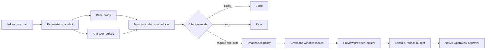

# Human Gate architecture

## Product boundary

Human Gate is a policy and presentation layer over OpenClaw's native plugin
approval flow. It does not execute commands, mutate tool parameters, implement
an approval UI, or read target files to enrich a preview.

The v0.2 production minimum is intentionally **upgrade-only**:

- the base policy remains the authority for ordinary tool classification;
- semantic analysis may raise the minimum mode or severity;
- analysis never turns a gated call into an automatic pass;
- malformed, oversized, or unsupported inputs do not receive a wider grant;
- an explicit block is terminal and its operator-facing reason is preserved.

## Request pipeline



The same structured-clone snapshot is used for analysis, preview generation,
and the `params` returned alongside `requireApproval`. A value that cannot be
cloned is blocked. This prevents approval of one object followed by execution
of a caller-mutated object.

## Extension contracts

`ToolCallAnalyzer` is a synchronous, pure, no-I/O contract:

```ts
interface ToolCallAnalyzer {
  readonly id: string;
  readonly priority: number;
  supports(context: ToolCallContext): boolean;
  analyze(context: ToolCallContext): AnalysisResult;
}
```

An analyzer returns findings and minimum constraints, not a final decision.
`AnalyzerRegistry` combines all matching results monotonically. Stable finding
IDs are suitable for tests and audit logs; raw parameters are not logged.

`ApprovalPreviewProvider` follows the same separation:

```ts
interface ApprovalPreviewProvider {
  readonly id: string;
  readonly priority: number;
  supports(context: ToolCallContext): boolean;
  build(context: ToolCallContext, config: ApprovalPreviewConfig): PreviewSection | undefined;
}
```

Providers return untrusted preview material. Only `ApprovalPresenter` may turn
that material into the host description, enforcing centralized sanitization,
redaction, indentation, and the 512-character OpenClaw limit. A provider
failure suppresses its advisory preview but never suppresses the gate.

## Command semantics

Ordinary shell execution and Code Mode are separate analyzers. Code Mode's
`command` field is JavaScript/TypeScript source, not a shell command.

The shell analyzer scans POSIX, PowerShell, and CMD syntax and takes the union
of risk findings because the hook does not expose an authoritative runtime
shell. The scanner recognizes quoted tokens, control operators, redirections,
dynamic expansion, and nested `sh -c`, `cmd /c`, and PowerShell `-Command`
wrappers up to a configured depth. It never expands variables, resolves
aliases/functions, or evaluates input.

The MVP promotes these classes to critical:

- remote content piped to an interpreter;
- recursive forced deletion;
- Git force-push and destructive history/worktree operations;
- destructive infrastructure commands and apparent production deployments;
- encoded or dynamic execution;
- likely credential-source plus network-sink combinations;
- dynamic Code Mode evaluation.

Output redirection, privilege elevation, dynamic expansion, and partial
analysis produce warning findings. They never justify auto-authorization.

## Critical invariants

A critical effective decision:

- requires approval unless an explicit user block already applies;
- removes `allow-always` from the available decisions;
- bypasses previously stored `allow-always` grants;
- bypasses approval windows;
- is blocked in unattended cron/heartbeat contexts by default;
- uses timeout behavior `deny`.

These invariants close the loop between semantic classification and the
existing approval-window implementation.

## Preview security

Only data already present in hook parameters is previewed. Human Gate does not
read the filesystem because the hook has no authoritative workspace/cwd and
additional reads could expose unrelated secrets.

The preview pipeline removes ANSI/OSC sequences and unsafe control characters,
marks bidirectional controls, redacts common tokens/credentials/private keys,
limits scanning work, limits files and lines, indents untrusted body content,
and finally applies the host's hard description budget. Redaction is defense in
depth, not a complete DLP system; operators should still avoid routing approval
messages to untrusted channels.

## Known limits and next increments

- Cron/heartbeat detection is a session-key heuristic because the hook exposes
  no authoritative trigger kind.
- Non-critical `allow-always` remains scoped by `(rule, tool, session)`, and a
  same-tool window remains broader than a parameter fingerprint. The next
  increment should introduce semantic scope keys such as path root, remote,
  environment, and Git ref.
- The scanner is not a complete shell AST. Here-documents, process substitution,
  aliases, functions, and runtime expansion remain intentionally untrusted.
- Redaction patterns are bounded and best-effort.
- If another higher-priority plugin already owns approval, host merge semantics
  may choose that approval. Deployment documentation should treat hook priority
  ordering as part of the security configuration.

An adaptive mode that auto-passes analyzed commands is explicitly deferred.
It should only be considered after corpus-based false-negative measurement,
semantic scope windows, and authoritative shell/runtime metadata are available.
